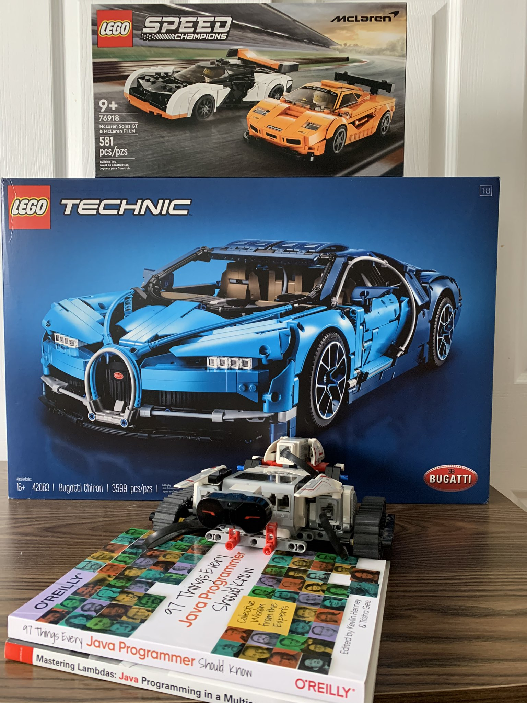

=== What to Choose?

==== Java Streams => Lego
* Basic building blocks
* Some assembly required
* More of the low-level control
* _Age: 9+_

==== Eclipse Collections => Lego Technic
* More specialized building blocks
* Performance optimized
* Still compatible with the basic building blocks
* _Age: 16+_

==== DataFrame-EC => Lego Mindstorms
* Even more specialized building blocks
* High-level approach
* Still compatible with the basic building blocks
* Can be programmed to accomplish tasks
* Simplifies some of the tasks that can be harder to achieve otherwise
* _Age: 10+_

---

link:toc.adoc[⬆️ TOC] /
link:./02_03_the_problem_what_to_choose.adoc[⬅️ What to Choose?] /
link:./03_01_conference_explorer_class.adoc[➡️ ConferenceExplorer] 🐢

