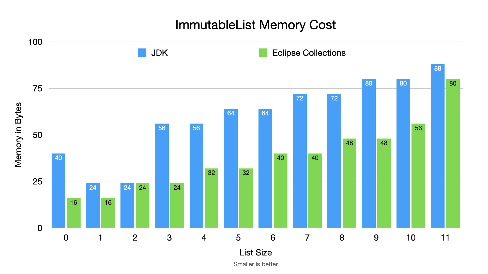

=== Memory Comparison - Sweating the Small Stuff

---

* *Beware*: Potential tradeoff of memory for performance. JDK balanced optimization to reduce possibility of megamorphic calls. Eclipse Collections saved every possible byte due to 32-bit limits. YMMV.
* *Recommendation*: If you have a lot of small immutable collections, consider using Eclipse Collections

link:toc.adoc[⬆️ TOC] /
link:./11_mutable_vs_immutable_sets.adoc[⬅️ Memory Footprint - Mutable vs. Immutable Sets] /
link:./13_the_problem_what_to_choose_details.adoc[➡️ What to choose?] 🐢
