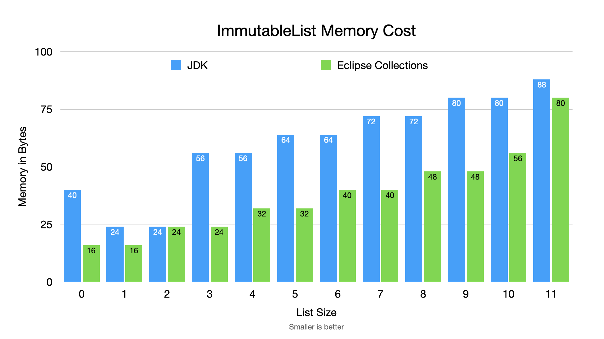

=== Memory Comparison - Sweating the Small Stuff

---

* *Blog:* link:https://betterprogramming.pub/sweating-the-small-stuff-in-java-dbd695166d13?source=friends_link&sk=aefca6a94a35340fccbcdbe9131036c1[Sweating the small stuff in Java] (for more background and details)
* *Beware*: Potential tradeoff of memory for performance. YMMV.
* *Recommendation*: If you have a lot of small immutable collections, consider using Eclipse Collections

link:toc.adoc[⬆️ TOC] /
link:./12_mutable_vs_immutable_sets.adoc[⬅️ Memory Footprint - Mutable vs. Immutable Sets] /
link:./14_exploring_three_libraries.adoc[➡️ Exploring three libraries] 🐢
