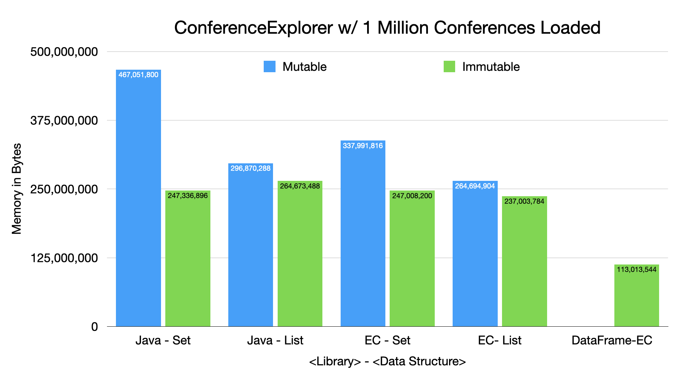

=== Conference Explorer - Memory Cost Comparison - Mutable vs. Immutable

---

* Many mutable data structures pad for growth to reduce copying and amortizing performance
* If you have long-lived in-memory data, a final "trim" operation can save significant memory
* *Recommendation:* Consider growing with Mutable data structures with a final copy to an Immutable data structure
* *Why are the collection approaches comparing so badly to DataFrame-EC?*
** *Hint:* It's not the data structures, it's the data!

link:toc.adoc[⬆️ TOC] /
link:./14_conference_explorer_class.adoc[⬅️ Conference Explorer] /
link:./14_02_ce_memory_cost_pooling.adoc[➡️ ConferenceExplorer - Memory Cost - Pooling] 🐢
