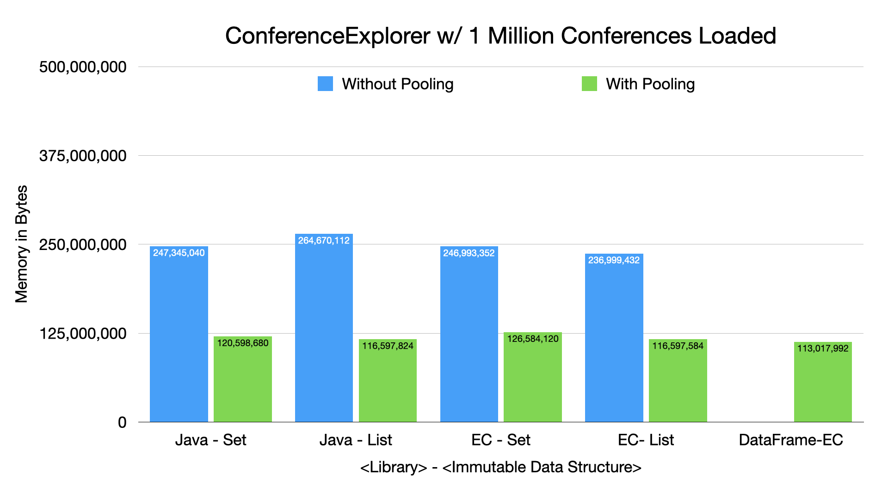

=== Conference Explorer - Memory Cost Comparison

---

* We didn't change anything with DataFrame-EC
* We implemented custom pooling using Eclipse Collections for Collections-based solutions
* *Recommendation:* Understand your data and analyze using JOL or other heap analysis tools

link:toc.adoc[⬆️ TOC] /
link:./14_conference_explorer_class.adoc[⬅️ Conference Explorer] /
link:./15_conference_explorer_group_by_country.adoc[➡️ ConferenceExplorer - Group by Country] 🐢
