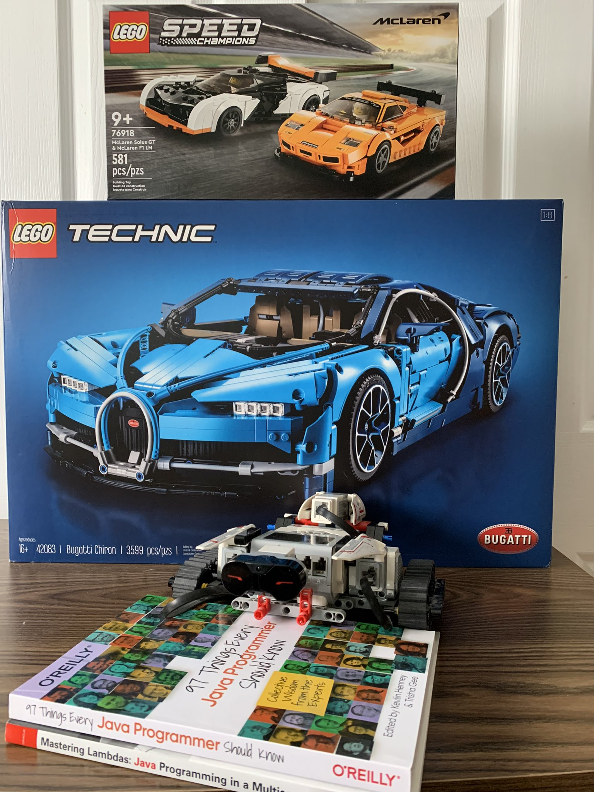

=== Exploring three libraries

==== Java Streams => Lego (_9+_)
* Basic building blocks
* Some assembly required
* More of the low-level control
* Row-based Domain Objects

==== Eclipse Collections => Lego Technic (_16+_)
* More specialized building blocks
* Performance optimized
* Still compatible with the basic building blocks
* Row-based Domain Objects

==== DataFrame-EC => Lego Mindstorms (_10+_)
* Even more specialized building blocks
* High-level approach
* Still compatible with the basic building blocks
* Can be programmed to accomplish tasks
* Simplifies some of the tasks that can be harder to achieve otherwise
* Column-based Tabular Data Structure

---

link:toc.adoc[⬆️ TOC] /
link:./13_sweating_the_small_stuff.adoc[⬅️ Sweating the Small Stuff] /
link:./15_conference_explorer_class.adoc[➡️ ConferenceExplorer] 🐢

