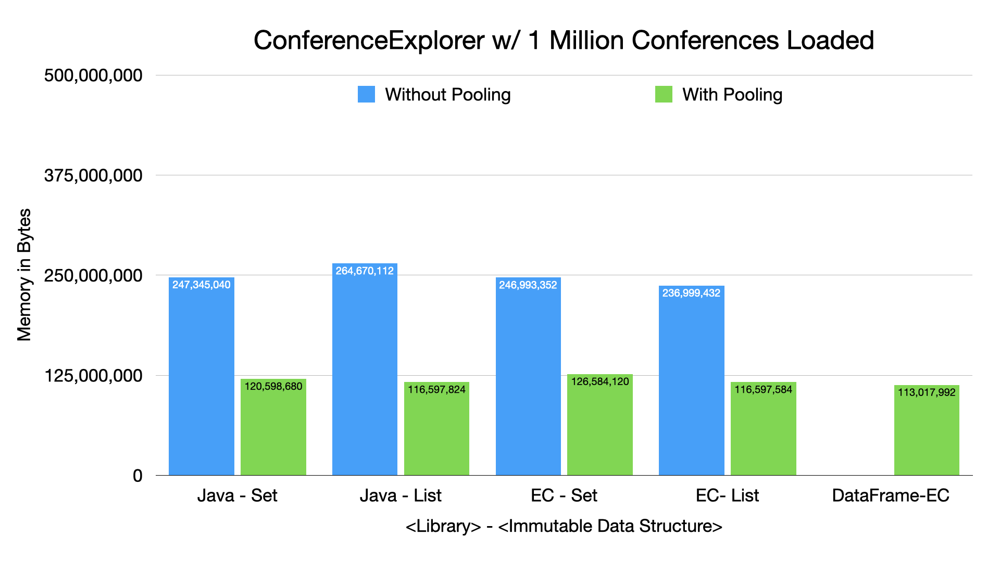

=== Conference Explorer - Memory Cost Comparison - Pooling Data

---

* It's not the data structures, it's the data! Pooling significantly reduces duplicated data cost.
* We implemented custom pooling using Eclipse Collections for Collections-based solutions
* *Recommendation:* Understand your data and analyze using JOL or other heap analysis tools

link:toc.adoc[⬆️ TOC] /
link:./16_ce_memory_cost_mutable_immutable.adoc[⬅️ Conference Explorer - Memory Cost Comparison - Mutable vs. Immutable] /
link:./18_what_is_pooling.adoc[➡️ What is Pooling?] 🐢
