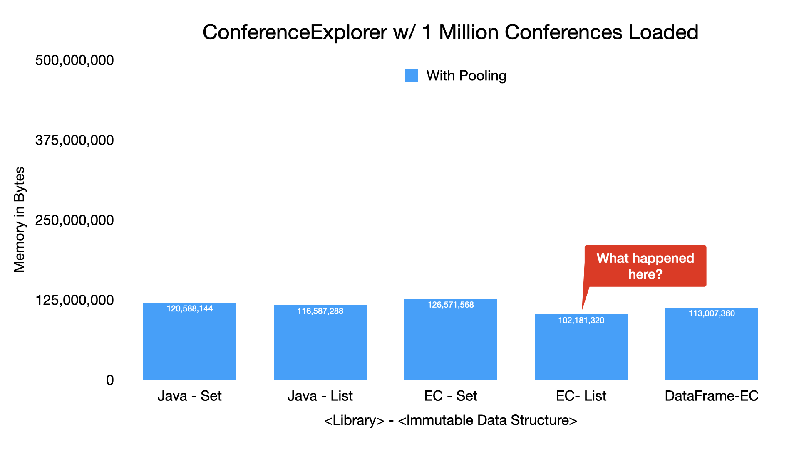

=== Conference Explorer - Fine Tuning for Memory Savings

---

* *Step 1*: We converted one `int` field to `byte`, and three `int` fields to `short` (reduction: 16 bytes -> 7 bytes)
* *Step 2*: We converted two `LocalDate` Fields to a single `Twin<LocalDate>` field and pooled both of the `LocalDate` instances and the `Twin`. (Reduction: 8 bytes -> 4 bytes, Addition: 66,428 instances of `Twin` at 24 bytes each)
* *Result:* For EC-List we were able to compress the per-Conference cost from 56 bytes to 40 bytes each

link:toc.adoc[⬆️ TOC] /
link:./20_rows_vs_columns.adoc[⬅️ Row-based vs. Column-based Structures] /
link:./22_ce_memory_cost_25_million.adoc[➡️ Conference Explorer - 25 Million Rows] 🐢
