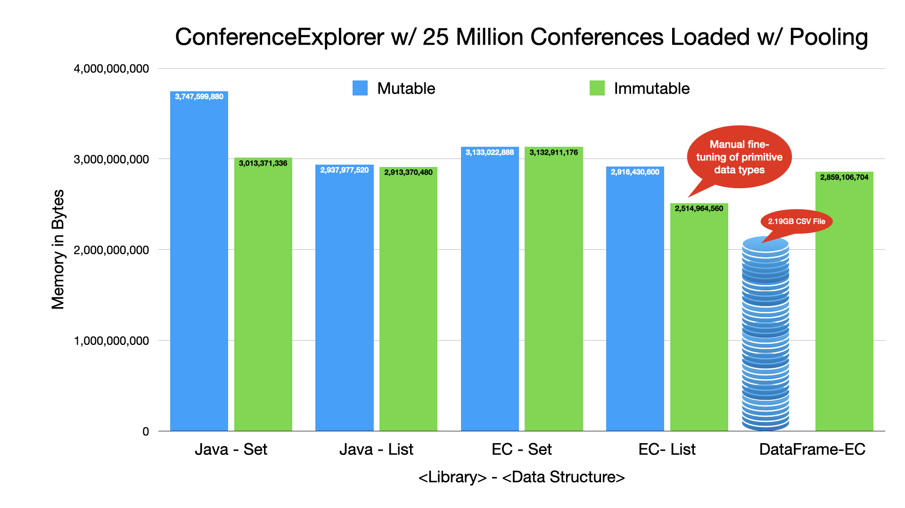

=== Conference Explorer - Memory Cost - Scaling Conferences x25

---

* *Issue:* Out of memory error loading via Jackson CSV
** Replaced call to `MappingIterator.readAll()` with using as `Iterator` directly
* *Recommendation:* Understand your data and analyze using JOL to find opportunities for memory savings

link:toc.adoc[⬆️ TOC] /
link:./21_ce_memory_fine_tuning.adoc[⬅️ Conference Explorer - Fine Tuning Memory] /
link:./23_the_future_of_java.adoc[➡️ What will the future bring?] 🐢
