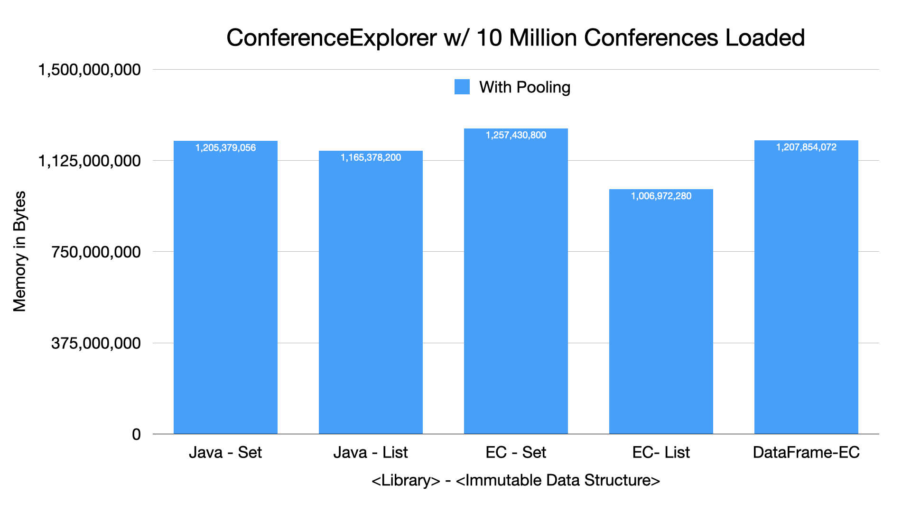

=== Conference Explorer - Memory Cost - 10 Million Conferences

---

* At ten million conferences, we see the memory savings scaling well
* *Recommendation:* Understand your data and analyze using JOL to find opportunities for memory savings

link:toc.adoc[⬆️ TOC] /
link:./21_ce_memory_fine_tuning.adoc[⬅️ Conference Explorer - Fine Tuning Memory] /
link:./25_java_streams.adoc[➡️ Java Streams] 🐢
